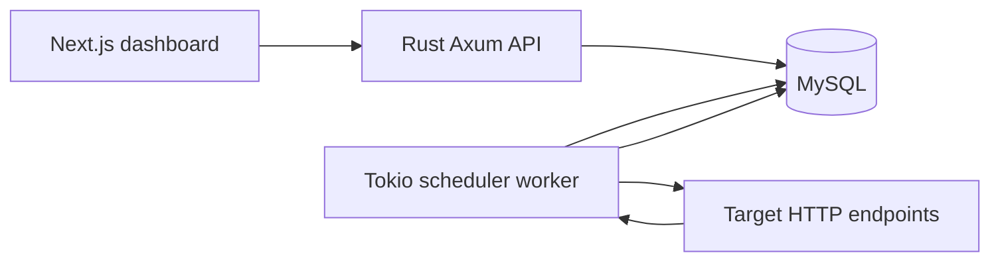

<p align="center">
  
</p>

<h1 align="center">Kestro</h1>

<p align="center">
  <strong>Self-hosted HTTP scheduling with a focused dashboard, Rust worker, and MySQL persistence.</strong>
  <br />
  <em>Create recurring API jobs, run them manually, import Bruno requests, and inspect execution history from one local tool.</em>
</p>

<p align="center">
  <a href="#quick-start"></a>
  <a href="#api-reference"></a>
  
  
  
  
  
  
</p>

---

**You have recurring endpoint calls scattered across scripts, cron tabs, and manual runbooks. Which jobs are live, what failed, and when will the next one run?**

Kestro is a lightweight scheduler inspired by Google Cloud Scheduler. It gives you a Next.js dashboard backed by a Rust Axum API and scheduler worker. Jobs are stored in MySQL, executed as HTTP requests, retried on failure, and recorded with status, latency, HTTP code, errors, and response snapshots.

> The goal is not to replace a full workflow engine. Kestro focuses on one job: make HTTP scheduling visible, editable, and easy to run locally or self-host.

---

## Features

<table>
  <tr>
    <td width="50%" valign="top">
      <h3>Schedule HTTP jobs</h3>
      <p>Create, edit, pause, resume, delete, and manually run schedules for <code>GET</code>, <code>POST</code>, <code>PUT</code>, <code>PATCH</code>, <code>DELETE</code>, <code>HEAD</code>, and <code>OPTIONS</code> requests.</p>
    </td>
    <td width="50%" valign="top">
      <h3>Rust scheduler worker</h3>
      <p>A Tokio worker checks due schedules on a configurable interval, advances the next run, executes requests, and persists each result.</p>
    </td>
  </tr>
  <tr>
    <td width="50%" valign="top">
      <h3>Execution history</h3>
      <p>Inspect recent runs with success/failure status, HTTP status code, duration, error message, and truncated response body.</p>
    </td>
    <td width="50%" valign="top">
      <h3>Bruno request import</h3>
      <p>Upload a <code>.bru</code> request and preview it as a paused schedule draft with copied method, URL, headers, body, and query params.</p>
    </td>
  </tr>
  <tr>
    <td width="50%" valign="top">
      <h3>Operational dashboard</h3>
      <p>Use the dashboard to search schedules, watch run history, review worker status cards, and view the local API surface.</p>
    </td>
    <td width="50%" valign="top">
      <h3>MySQL persistence</h3>
      <p>Schedules and executions are stored in MySQL through SQLx migrations, with local infrastructure provided by Docker Compose.</p>
    </td>
  </tr>
</table>

---

## Quick Start

### 1. Install dependencies

```bash
npm install
```

### 2. Start MySQL

```bash
docker compose up -d mysql
```

### 3. Create the API environment file

```bash
cp apps/api/.env.example apps/api/.env
```

### 4. Run the API and worker

```bash
npm run dev:api
```

The API starts on `http://127.0.0.1:8080` by default. The same process also starts the scheduler worker.

### 5. Run the dashboard

```bash
npm run dev:web
```

Open:

- Dashboard: `http://localhost:3000`
- API health check: `http://127.0.0.1:8080/health`

You can also run `npm run start` or `npm run start:server` to start the web app on the first free port from `3000` to `3010`.

---

## Tech Stack

| Layer | Stack |
| --- | --- |
| Frontend | Next.js 15, React 19, TypeScript, Tailwind CSS, Radix UI, TanStack Query, React Hook Form, Zod, Lucide React |
| Backend | Rust 2024, Axum 0.8, Tokio, SQLx 0.8, Reqwest, Serde, Chrono, `cron`, `dotenvy`, Tracing |
| Database | MySQL 8.4 |
| Local infrastructure | Docker Compose |
| Workspace tooling | npm workspaces, Cargo workspace |

---

## Project Structure

```text
.
├── apps
│   ├── api
│   │   ├── migrations       # SQLx MySQL migrations
│   │   └── src/main.rs      # Axum API, scheduler worker, Bruno import parser
│   └── web
│       ├── app              # Next.js app router entry
│       ├── components       # Dashboard and UI primitives
│       ├── lib              # Shared frontend types and utilities
│       └── public/logo.png
├── docker-compose.yml       # Local MySQL service
├── package.json             # Root npm workspace scripts
├── Cargo.toml               # Rust workspace
└── README.md
```

---

## Configuration

The API loads environment variables from the first readable file in this order:

1. `apps/api/.env`
2. `.env`

Those files are not merged. If both exist, `apps/api/.env` wins. The root `.env` in local development may use `DB_PASS`; `apps/api/.env.example` uses `DB_PASSWORD`. The backend accepts either name.

### API environment

| Variable | Default | Description |
| --- | --- | --- |
| `DB_HOST` | `localhost` | MySQL host. |
| `DB_PORT` | `3306` | MySQL port. Must be a valid TCP port. |
| `DB_USER` | `kestro` | MySQL user. |
| `DB_PASSWORD` | `kestro` | MySQL password. |
| `DB_PASS` | unset | Optional fallback when `DB_PASSWORD` is not set. |
| `DB_NAME` | `kestro` | MySQL database name. |
| `DATABASE_URL` | unset | Optional full MySQL connection string. When set, it overrides the `DB_*` values. |
| `BIND_ADDR` | `127.0.0.1:8080` | API host and port. |
| `SCHEDULER_TICK_SECONDS` | `30` | How often the worker checks for due schedules. Invalid values fall back to `30`. |

Example:

```dotenv
DB_HOST=localhost
DB_PORT=3306
DB_USER=kestro
DB_PASSWORD=kestro
DB_NAME=kestro
BIND_ADDR=127.0.0.1:8080
SCHEDULER_TICK_SECONDS=30
```

### Web environment

The dashboard reads the API base URL from:

```dotenv
NEXT_PUBLIC_API_URL=http://127.0.0.1:8080
```

This value is optional. If it is not set, the frontend defaults to `http://127.0.0.1:8080`. For local overrides, create `apps/web/.env.local` because the web server runs from `apps/web`.

---

## How It Works



1. The dashboard sends schedule CRUD, manual run, and Bruno import requests to the API.
2. The API validates schedule input, runs SQLx migrations on startup, and stores schedules in MySQL.
3. The worker scans active schedules whose `next_run_at` is due.
4. Before dispatching a due schedule, the worker calculates and stores the following `next_run_at`.
5. The worker sends the configured HTTP request, retries failures, and records an execution row.

Backend behavior to know:

- MySQL sessions are set to UTC with `SET time_zone = '+00:00'`.
- CORS is open for local dashboard access.
- Each scheduler tick loads up to 25 due schedules.
- A run is marked `success` only for HTTP `2xx` responses.
- Failed runs retry with short incremental delays.
- Execution response bodies are truncated to 2,000 characters before storage.

---

## Dashboard

The main dashboard lives in `apps/web/components/scheduler-dashboard.tsx` and uses TanStack Query for API state.

| View | Purpose |
| --- | --- |
| Schedules | Search jobs, create/edit schedules, toggle active/paused status, delete schedules, and run jobs immediately. |
| History | Review recent executions across schedules with status, duration, HTTP code, and errors. |
| Workers | Inspect local scheduler status cards derived from schedule and execution data. |
| API | See the API base URL, endpoint list, and Bruno import example. |

Frontend validation mirrors backend constraints:

- `name` must be at least 3 characters.
- `targetUrl` must be a valid URL.
- `headers` must be empty or a JSON object.
- `timeoutSeconds` must be between `1` and `120`.
- `retryCount` must be between `0` and `5`.

---

## API Reference

| Method | Path | Description |
| --- | --- | --- |
| `GET` | `/health` | Check API and database connectivity. |
| `POST` | `/api/imports/bruno/request` | Preview one Bruno `.bru` request as a schedule draft. |
| `GET` | `/api/schedules` | List schedules, newest first. |
| `POST` | `/api/schedules` | Create a schedule. |
| `GET` | `/api/schedules/{id}` | Get one schedule by UUID. |
| `PATCH` | `/api/schedules/{id}` | Update one schedule. |
| `DELETE` | `/api/schedules/{id}` | Delete one schedule. |
| `POST` | `/api/schedules/{id}/run` | Run a schedule immediately. |
| `GET` | `/api/schedules/{id}/executions` | List the latest 100 executions for a schedule. |

### Create a schedule

```bash
curl -X POST http://127.0.0.1:8080/api/schedules \
  -H "Content-Type: application/json" \
  -d '{
    "name": "Billing reconciliation",
    "targetUrl": "https://api.example.com/jobs/reconcile",
    "method": "POST",
    "cronExpression": "*/15 * * * *",
    "headers": {
      "Content-Type": "application/json"
    },
    "payload": "{\"mode\":\"incremental\"}",
    "status": "active",
    "timeoutSeconds": 30,
    "retryCount": 2
  }'
```

### Run a schedule immediately

```bash
curl -X POST http://127.0.0.1:8080/api/schedules/{id}/run
```

### Import a Bruno request preview

```bash
curl -X POST http://127.0.0.1:8080/api/imports/bruno/request \
  -F "file=@./requests/billing.bru"
```

The Bruno import endpoint does not create a schedule. It returns a paused draft with a default hourly cron expression, copied headers, copied body, appended query params, and warnings for unresolved Bruno variables or unsupported blocks such as scripts, tests, auth, cookies, docs, and collection variables.

---

## Schedule Rules

- Target URLs must use `http` or `https`.
- Headers must be a JSON object.
- Status must be `active` or `paused`.
- Timeout must be between `1` and `120` seconds.
- Retry count must be between `0` and `5`.
- Five-field cron expressions are accepted and normalized by adding seconds as `0`.

---

## Database

Local MySQL is defined in `docker-compose.yml`:

| Setting | Value |
| --- | --- |
| Service | `mysql` |
| Image | `mysql:8.4` |
| Container | `kestro-mysql` |
| Port | `3306` |
| Volume | `kestro-mysql` |

The initial migration creates:

- `schedules`
- `executions`
- indexes for due schedules and execution history

Stop local MySQL:

```bash
docker compose down
```

Stop local MySQL and remove persisted data:

```bash
docker compose down -v
```

---

## Scripts

| Command | Description |
| --- | --- |
| `npm run start` | Alias for `npm run start:server`. |
| `npm run start:server` | Start the web dev server on the first free port from `3000`. Honors `HOST`, `PORT`, and `MAX_PORT`. |
| `npm run dev:web` | Start the Next.js development server. |
| `npm run build:web` | Build the web app. |
| `npm run lint:web` | Run ESLint for the web app. |
| `npm run dev:api` | Run the Rust API and scheduler worker. |
| `npm run check:api` | Run `cargo check` for the API crate. |

---

## Verification

Run these checks before shipping changes:

```bash
npm run lint:web
npm run build:web
npm run check:api
```

<p align="center">
  <strong>Make recurring HTTP jobs visible, editable, and easy to operate.</strong>
</p>
